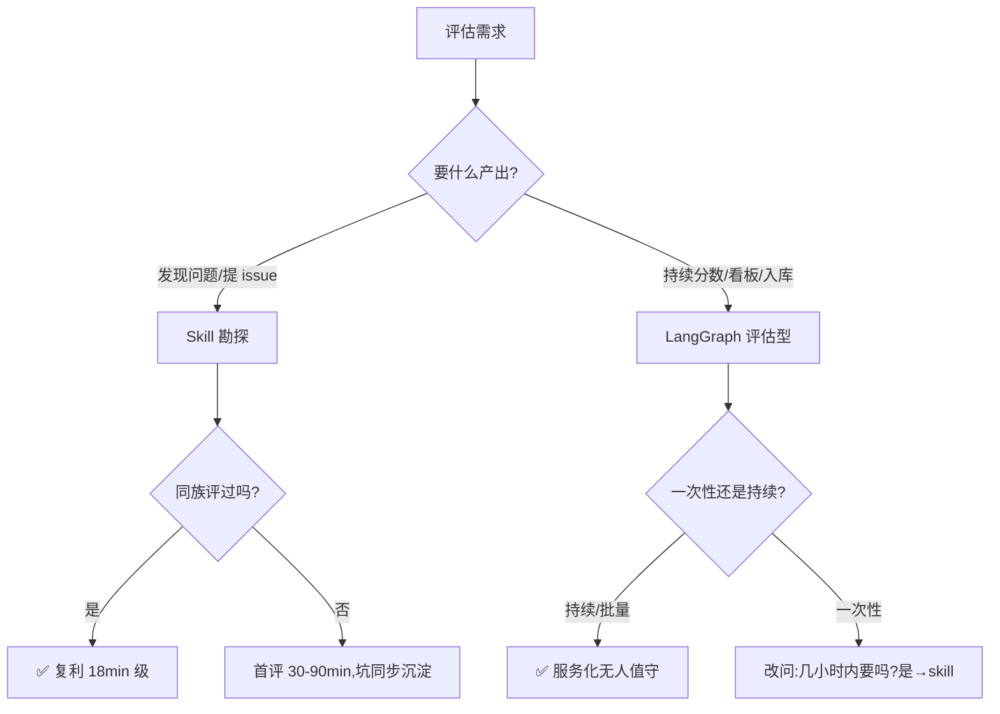

  # 应用场景对比:Skill+Coding Agent vs LangGraph 评估编排 — 谁该在哪用

**版本** v1.3  | **定位**: 应用场景选型报告,功能描述**以本仓当前分支(coding_agent)实际代码为准**。指标口径差异见《[langgraph_vs_skill_evaluation_comparison.md](./langgraph_vs_skill_evaluation_comparison.md)》。

**数据基线(双侧实测,只列场景相关量)**:

| | Skill + Coding Agent | LangGraph 原生编排 |
|---|---|---|
| 样本 | 5 项目实测,累计 15 个可提交项目问题 | **38 个独立项目、276 份报告**(10 天,批量运行目录) |
| 复测深度 | 每项目 1 轮 | amct 22 轮 / cann-samples 26 轮(高频复测) |
| 单项目时长 | 18–86 分钟(**会话在场**) | 单轮墙钟 ≈5 小时(**无人值守**) |
| 部署 | 一个 SKILL.md + docker | 本仓源码 + 服务栈(RabbitMQ/ES/Redis/Celery,api/+dispatcher/) |

> 唯一要记住的指标差异:LangGraph 的分数与耗时是公式算的(可横比、可入库),skill 是估算的(仅供单项目内参考)。下文不再展开。

---

## 一、两种形态的本质区别

| | Skill + Coding Agent | LangGraph 原生编排(当前分支) |
|---|---|---|
| **本质** | **带判断力的探路者**:一个会话内完成 编排决策 + 变通修复 + 归因审计 | **确定性测量仪**:代码编排,同一输入必得同一结构化输出 |
| **编排载体** | SKILL.md 指令驱动 Claude 复刻四节点 | Python StateGraph 显式状态机 |
| **执行载体** | docker 容器 + Claude 工具箱(**任意组合**) | MCP 9 工具(Playwright/持久 Shell/Git,**封闭集合**) |
| **遇到障碍** | **自愈三档**:环境坑真修 / 宿主坑绕行 / 项目坑如实上报 | **LLM 退避重试**(指数退避 3 次)+ advisor 自主换思路重规划;仍失败即 early_exit **如实记败**(丢后续阶段数据但结果诚实) |
| **上下文保护** | 会话窗口自管理 | advisor 单次 prompt 上限 + 滑动窗口缩减历史 |
| **在场要求** | 需要会话/Token 在线(每步都是 LLM 决策) | 启动后自走,服务化可并行多项目 |

---

## 二、决定场景归属的三个实测事实

### 事实 1:skill 有踩坑复利,LangGraph 没有

| 项目顺序 | 耗时 | 说明 |
|---------|------|------|
| ops-math(首测) | 86 min | 5 轮编译迭代,踩 7 坑 |
| torchtitan-npu | 77 min | 异族新坑(含 3.7GB CANN 下载) |
| hccl / cann-samples | 25 / 28 min | 部分复用 |
| **ops-cv(同族)** | **18 min** | **预置 ops-math 全部坑修复后,编译一次过** |

坑沉淀进 SKILL.md → 同族下轮免疫。LangGraph 每项目独立,经验传导靠改代码发版。**→ 同族复测场景归 skill。**

### 事实 2:自愈边界 = 交付边界

```
根因在环境/用法侧 → 真自愈(8 处:pip 降级/缺 gcc/CANN 损坏替换…)
根因在宿主层     → 绕行(6 处:TLS 分组降卡/手动链接…)
根因在项目侧     → 不代修,如实上报(3 处:CI 硬编码/清单矛盾/LLT 缺口)
```

三个"修不动"的项目侧痛点恰好是全部评估里**优先级最高的交付物**——**→ 要"走完全程"且"深挖问题"的场景归 skill;要"如实记录失败"的测量场景归 LangGraph(它 early_exit 记败恰是测量本分)。**

### 事实 3:吞吐与在场方式完全不同

- LangGraph:38 项目×多轮/10 天,**无人值守**,单轮墙钟 ≈5h 但不需要人;服务栈自带重投护栏(Redis 执行锁+终态幂等,当前分支 dispatcher/ 已实现)
- skill:五项目 3.9 小时,**人机协同**(每步 LLM 决策),但 18 分钟出一个单项目全套结论

**→ 批量/定时/过夜场景归 LangGraph;几小时内要结论的单项目归 skill。**

(注:LangGraph 报告里"工具执行耗时"与墙钟总时长是两个口径,读数时注意区分。)

---

## 三、应用场景矩阵(按评估生命周期分组,含触发信号)

### 勘探期(发现问题)— Skill 领地

| # | 场景 | 触发信号(你什么时候需要它) | 为什么是 Skill | 实测依据 |
|---|------|------------------------|---------------|---------|
| 1 | **新项目/新族首轮评估** | 接手一个没评过的仓,不知道文档靠不靠谱、环境多深 | 自愈保走完全程;坑全部带归因+修复路径 | ops-math 7 坑全挖出,5 坑真修 |
| 2 | **同族项目复测** | 又来一个同族仓(如同为 CANN 算子库) | 踩坑库复利:18 分钟零修复 | ops-cv 86→18min 曲线 |
| 3 | **产出可提交的 issue 清单** | 要给项目方提真问题,不想被退回 | 五要素(归因+严重度+最小修复+耗时+证据),15 问题全部可提交口径 | 五项目清单 |
| 4 | **家族/生态级问题挖掘** | 单仓 issue 说服力弱,要拿家族级证据上报上游 | 跨项目共性坑合并是内建语义 | install_deps 坑 ×2、libstdc++ 坑 ×2(建议上报 CANN) |
| 5 | **极端环境/文档缺失项目** | 文档缺步骤、示例跑不起来、环境怪 | 文档外变通(自拼链接/降卡)是 coding agent 本能 | ops-cv 自拼 6 个 -I/-L;TLS 降卡 |
| 6 | **快速单项目体检** | 几小时内要结论 | 18–86 分钟全套 | 五项目 |

### 测量期(持续量化)— LangGraph 领地(当前分支能力)

| # | 场景 | 触发信号 | 为什么是 LangGraph | 实测依据 |
|---|------|---------|-------------------|---------|
| 7 | **定时批量评估** | 每天自动跑 N 个项目 | 服务化无人值守(api+dispatcher,Celery 队列/回调/幂等护栏);38 项目×多轮/10 天 | 批量目录 |
| 8 | **回归监测** | 同项目反复跑,关注变化 | 可复现是硬要求;amct 22 轮 | 复测密度 |
| 9 | **横向对比/趋势看板** | 多项目等分比较、分数走势 | 公式计算,同口径可横比;skill 是估算不可横比 | — |
| 10 | **报告入库/下游对接** | 要进 OpenSearch、供 API 查询 | schema 代码级确定性;本仓自带 opensearch_uploader(三件齐自动上传) | devx_main.py 调用链 |

### 支撑类(两种形态的比较优势)

| # | 场景 | 推荐 | 理由 |
|---|------|------|------|
| 11 | **人工复核工作流**(结论交人审) | Skill | 痛点带修复路径与证据可逐条核;估算分天然提示"需人判断",不伪装精确 |
| 12 | **无人值守/过夜跑** | LangGraph | skill 需会话在线,中断靠容器+日志留痕缓解但不免疫 |
| 13 | **并发多项目同时评** | LangGraph | 服务化队列+槽位调度(dispatcher 并发槽/硬件族队列);skill 单会话串行,多会话则人看不过来 |
| 14 | **超长评估**(六阶段全开/大输出项目) | LangGraph | 状态外置+滑动窗口裁剪历史,不受会话窗口限制;skill 受上下文窗口约束,长评估可能触发压缩丢细节 |
| 15 | **断点续跑/失败重跑** | LangGraph | 显式状态机可回放,终态幂等+执行锁防重复;skill 会话中断即从头(容器内环境还在,但评估结论链需重建) |

### 选型决策树



### 同场景行为差异对照(六组经典情境)

上面矩阵回答"谁赢";这六组回答"**同一情境下,两边各自实际会发生什么**"(全部来自五项目实测与批量运行目录,是"区别"的最直接呈现):

| 情境 | Skill 实际行为(实测) | LangGraph 实际行为(当前分支) | 区别本质 |
|------|---------------------|---------------------------|---------|
| **① 编译反复失败**(ops-math 5 轮) | 读错误→定位 `dependencies.cmake`→sed 豁免假阳性→装 pip→设头文件路径→**5 轮迭代后编译通过,继续 S3/S4**,全程每轮都留痛点记录 | advisor 换思路重试若干次→仍败→**early_exit**:quickstart 记 0 分,后续任务进 skipped,报告如实呈现"到此为止" | 一个"修着走完"(拿完整旅程),一个"如实记败"(拿诚实截断)——同一失败,产出物形态完全不同 |
| **② 依赖脚本伪成功**(install_deps skip googletest) | **skip 信号捕获**(v2 规则):输出含 skipping 即判伪成功→当场补装→环境零缺口往下走 | 退出码 0=success,**带着缺依赖的环境继续**,直到 UT 阶段才爆 7 例失败——症状离根因两个阶段 | skill 有"伪成功识别"先验;LangGraph 只认退出码,延迟暴露 |
| **③ 运行环境损坏**(宿主 HCCL 缺符号) | 链接报 undefined symbol→nm 查符号提供者→**自编译同版本包替换→手动指定新库链接→降 2 卡绕过 TLS**,最终拿到正确输出 | 同环境会直接任务失败;换库/降卡属"模板外操作",9 工具集合内无路径 | 变通自由度:任意工具组合 vs 封闭工具集 |
| **④ 文档缺步骤**(ops-cv 示例无编译指引) | **自拼 6 个 -I/-L 构造链接命令**,示例照样跑通,并把"指引缺失"记为项目问题 | 示例任务按文档步骤走→文档没有的步骤无从而来→任务失败 | 文档外能力:skill 能"无中生有",LangGraph 严格"按文档" |
| **⑤ 同一项目第 N 次评估** | 每次都需会话发起;结论可能漂移(估算口径);但**同族踩坑免疫**(ops-cv 18min 零修复) | 定时自跑无需人;**口径恒定可回放**;amct 22 轮曲线可直接画趋势;但每轮坑都从头踩(经验不跨项目传导) | 复测形态:skill"每次新探",LangGraph"每次同测" |
| **⑥ 结论的消费者** | 人:痛点五要素直接对 issue 模板,逐条可核 | 系统:13 键 JSON 入库 OpenSearch,API 可查,看板可画 | 产出物基因:为"人提交"设计 vs 为"系统消费"设计 |

> 这六组也是**切换信号**:当你更在意左列行为(修完继续/伪成功当场抓/文档外变通/人审 issue)→ 用 skill;当你更在意右列(诚实截断/口径恒定/可回放/入库)→ 用 LangGraph。

### 业务视角的应用场景(谁来用、拿什么产出)

技术矩阵回答"形态选择";下表回答**业务问题**——什么角色、带着什么业务目标来,该用哪条路径、拿到什么业务产出物:

| 业务场景 | 角色/触发 | 推荐路径 | 业务产出物 |
|---------|----------|---------|-----------|
| **生态仓体验摸底** | 生态运营:新纳入/接手一批仓,不知道底子 | **Skill 首轮勘探** | 每仓一份可提交 issue 清单(带修复建议),直接转给各仓维护者;五项目实测:15 个真问题 |
| **版本发布配套检查** | 平台方:CANN 发新版前,检查配套仓文档/构建是否跟上 | **Skill 同族复测**(踩坑免疫,18min/仓) | 配套就绪度清单:哪些仓在新版下文档过时/编译断裂,发布前拦截 |
| **生态体验看板/KPI** | 运营管理层:量化生态健康度,出季度报告 | **LangGraph 定时批量** | 38 仓×多轮的分数趋势看板(实测已有 276 份报告积累);体验分数作为生态 KPI |
| **修复效果回归验证** | 仓维护者:按 issue 修了问题,体验真的变好了吗 | **LangGraph 前后复测** | 修复前后同口径分数对比,"修复→分数提升"闭环证据 |
| **开发者支持降本** | 技术支持团队:新手工单太多,想提前堵住 | **Skill 勘探** | 高频卡点清单(按严重度排序:阻塞/绕过/噪音)→ 驱动 FAQ/文档改进,减少重复工单 |
| **选型参考** | 企业/开发者在多个候选库中做技术选型 | **LangGraph 横评** | 同口径横评榜单(可入库可复算);skill 估算分不可用于横比 |
| **新手教程生产** | 布道师/培训:写"避坑版上手指南" | **Skill 踩坑记录** | 带真实命令与修复路径的避坑素材(比访谈新手更快更全);ops-math 7 坑即现成教程骨架 |
| **上游系统性问题上报** | 生态方:单仓 issue 说服力弱,要推动 CANN 上游改 | **Skill 跨项目聚合** | 家族级证据(如 install_deps 坑 ×2 仓独立命中、工具链头文件路径 ×2)——推动的是上游一次修复、多仓受益 |
| **文档改进专项的效果评估** | 文档团队:做完文档专项,要向管理层证明价值 | **LangGraph 前后测 + Skill 抽验** | 分数变化(定量)+ 抽验仓的真问题是否消失(定性)双证据 |

**业务组合范式(与 §四 流水线对应)**:

- **运营一个生态的完整打法**:摸底(skill)→ issue 分发 → 各仓修复 → 回归验证(LangGraph)→ 看板汇报(LangGraph)→ 季度循环;上游系统性问题单独聚合上报(skill)
- **单个仓维护者的打法**:skill 拿 issue 清单 → 修复 → LangGraph 前后测拿改进证据 → 贴在 README/发布说明里当"体验改进"卖点

---

## 四、组合用法(生命周期流水线 + 数据流闭环)

```
新项目/新族 ──► [阶段1 勘探] Skill 首评 ──► 真问题清单(提 issue)+ 踩坑沉淀
                        │
                        ▼ 高价值项目/需持续监测
              [阶段2 测量] LangGraph 评估型 ──► 精确分 + 时序 + 看板
```

**三件回流,组合越用越快**:

1. **踩坑回流 skill**:评估坑 → SKILL.md → 同族下轮预置(86→18min)
2. **issue 回流项目**:skill 产出五要素 issue → 项目修复 → LangGraph 复测验证"真修好了"
3. **失败模式回流引擎**:skill 发现的新失败类型(如 CI 伪成功)→ 作为改进需求回流引擎开发(当前分支无内建规则通道,走常规 issue)

**分工口诀**:Skill 负责"**发现问题**",LangGraph 负责"**持续测量**"。

---

## 五、边界与风险(场景之外的清醒剂)

| 维度 | Skill 风险 | LangGraph 风险(当前分支) |
|------|-----------|------------------------|
| 复现 | 两次结果可能漂移 | 确定可回放 |
| 成本 | Token 不可预算;上下文窗口限超长评估 | 单轮 ≈5h;报告耗时口径与墙钟差异大 |
| 审计 | 会话态不可回放;修复无 diff 审计 | 结构化 JSON 日志(logs/json)+ trace_logs 可回放,但无逐工具裁决审计 |
| 失败面 | 幻觉修复(靠白名单意识);会话中断 | 服务栈运维;early_exit 丢后续阶段数据;重投类分布式问题(已有幂等护栏) |
| 经验 | 复利快但依赖人工沉淀进 SKILL.md | 经验靠发版,慢而稳 |
| 痛点质控 | 归因靠 skill 规则(v2 六分类+实证门槛),单会话自审 | 痛点由 evaluator LLM 生成,无独立复核环节 |

---

## 六、结论

两条路线不是竞争,是**评估生命周期的不同工序**:

1. **勘探期用 Skill**:走得完、挖得深、报得准;同族复测成本骤降(实测 86→18 分钟)。
2. **测量期用 LangGraph**:吞吐、复现、入库、无人值守不可替代;痛点无独立复核环节是当前已知短板。

**选型一句话**:要"**发现真问题**"找 skill,要"**持续量分数**"找 LangGraph。

---

## 附 A:Skill 五项目实测台账

| 项目 | 耗时 | 真问题数 | 代表性问题 |
|------|------|---------|-----------|
| ops-math | 86min | 3 | install_deps 非交互/-Werror 假阳性/--run_example 结构 |
| torchtitan-npu | 77min | 3 | pip -e . 静默降级(高危)/缺 gcc/dev 依赖脱节 |
| hccl | 25min | 3 | LLT 覆盖落差/Makefile 硬绑/gcc 范围滞后 |
| cann-samples | 28min | 3 | CI 默认架构硬编码(高危)/清单架构矛盾 |
| ops-cv | 18min | 3 | install_deps 伪成功(同族#2)/示例指引缺失 |

## 附 B:跨项目共性坑台账

| 共性坑 | 命中 | 归属 |
|--------|------|------|
| 镜像 /app/.venv 缺 pip | ×5 | 评估环境坑(不报项目) |
| install_deps googletest 非交互 skip | ×2 | **CANN 家族系统性(建议上报)** |
| bisheng 缺 libstdc++ 头路径 | ×2 | **CANN 工具链(建议上报)** |
| 依赖表漏 gcc/g++ | ×3 | 项目共性 |
| 版本约束滞后 | ×2 | 项目共性 |
| 宿主 HCCL 组件损坏 | ×2 | 宿主环境(修正一次历史误归因) |

## 附 C:LangGraph 批量运行画像

38 独立项目 / 276 报告 / 2026-08-04~08-14;复测 Top:cann-samples 26 轮、amct 22 轮、ascend-transformer-boost 19 轮;单轮墙钟 ≈5h16m(amct 日志实测)。

## 附 D:相关文档

- 指标口径对比:`docs/langgraph_vs_skill_evaluation_comparison.md`
- skill 本体:`.claude/skills/devx-orchestration/SKILL.md`(v2 规则)
